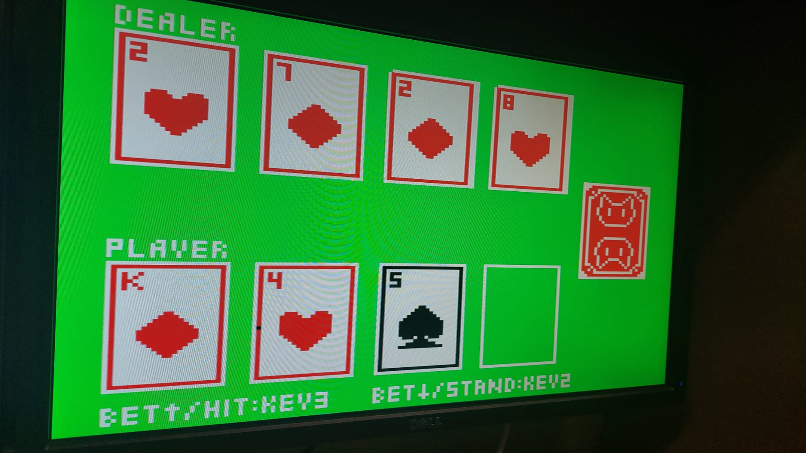
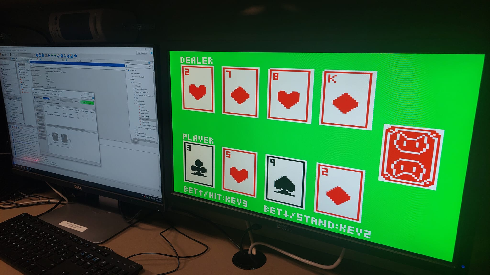

# ♠️ BlackJack

## By Pasha & Samuel

A hardware-based **Blackjack game** implemented entirely in **Verilog** and deployed to an **FPGA** with a **VGA output**. Designed with a finite state machine and hardware-based randomness.

The core logic includes a custom VGA controller, FSM-driven game flow, flip-flop-based registers, and a linear feedback shift register (LFSR) for generating pseudorandom cards — all written in synthesizable Verilog.

---

## 🎮 Features

- **Simplified Blackjack game** rendered to a VGA screen
- User input via physical switches and buttons (FPGA hardware)
- Pseudorandom card generation via 8-bit LFSR
- Supports "Hit" and "Stand" logic with dealer AI
- Betting system & calculation to win/loss state transitions
- Compact VGA graphics with clean layout (160x120 resolution)

---

## 🧠 Technical Highlights

- **Language**: Verilog HDL
- **Platform**: FPGA (tested on DE1-SoC, Cyclone V)
- **Display**: VGA signal generation using horizontal and vertical counters
- **Architecture**:
  - Flip-flops for state registers
  - FSM for game control flow
  - LFSR for randomness
  - 160x120 VGA resolution rendering logic

---

## 🖥 VGA Output

- Framebuffer constructed using counters and addressable memory blocks
- Resolution: **160x120** (low-res to simplify layout)
- Real-time updates for card draw and player/dealer hand values
- Card slots, score display, and game state messages

---

## 🎰 Game Logic Design

| Component         | Description |
|------------------|-------------|
| **FSM**          | Controls game phases (start, draw, player turn, dealer turn, result) |
| **Registers**    | Store card values, scores, game state |
| **LFSR**         | Generates random card values (1–10) |
| **VGA module**   | Drives red/green/blue and sync signals based on active pixel position |

## 📷 Gameplay Screenshot

---
